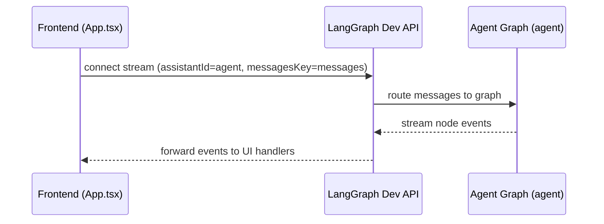
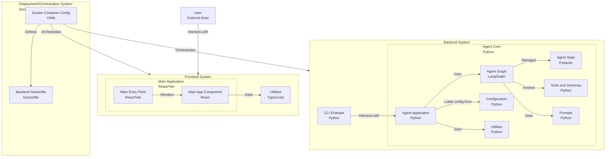

# API Steering Rules (Dev-Only)

Timestamp: 2025-08-14T15:52:17-04:00

## Version history

- v0.1.1 — 2025-08-14T15:52:17-04:00 — Add standardized sections and lint fixes
- v0.1.0 — 2025-08-14T11:22:57-04:00 — Initial dev-only rules

## Scope

- Dev-only LangGraph HTTP surface and streaming semantics.
- No new endpoints; do not invent shapes. Follow current wiring.

## References (components)

- `backend/src/agent/app.py` — dev HTTP server; mounts frontend under `/app`.
- `frontend/src/App.tsx` — stream client connects with `assistantId = "agent"` and `messagesKey = "messages"`.
- LangGraph dev server — exposes the graph registry (assistant `agent`) on the dev HTTP surface.

## Expectations (dev)

- API base (dev): backend LangGraph dev server (commonly on `http://localhost:2024`).
- Assistant identity: `agent` (must match the component's declared assistant id).
- Messages key: `messages` (must match the component's expected messages key).
- Event stream: front receives node events; map only known keys.

## Mermaid (interaction) + (structure)

## Do / Don’t

- Do: keep `assistantId` and `messagesKey` aligned end-to-end.
- Do: handle only known event keys; ignore unknowns safely.
- Don’t: add endpoints or parameters in docs; link to files instead.

## Validation Checklist (Dev)

- Assistant id equals `agent` and matches graph registry configuration.
- `messagesKey` is `messages` end-to-end (UI ↔ state).
- Dev API reachable: `curl http://localhost:2024/graphs` includes `agent`.
- SSE stream connects for `assistantId=agent` with proper headers.
- Unknown event keys are ignored safely in UI handlers.
- CORS allows localhost during dev.

## Rollback / Disable (Dev)

- Clear `VITE_API_URL` to fall back to the default dev base.
- Temporarily disable stream usage in UI to test request-only path.
- Revert to last known-good `assistantId` and `messagesKey`.

## Change Policy (Future-Proofing)

- Keep event keys stable; prefer additive changes.
- Do not add new endpoints; reference components and rules instead.
- Any schema changes must be reflected in backend state types and this doc.

## Changelog Summary

- v0.1.1 — Added Validation, Rollback/Disable, Change Policy; normalized spacing.

## Open Questions

- Should we expose a minimal health endpoint in dev or rely solely on `/graphs`?
- Any reserved event keys we should document to future-proof UI handlers?

## Lotus Wisdom Alignment (concise)

- Upaya (skillful means): keep surface minimal, stable keys, ignore unknowns.
- Direct: validate assistant id, messages key, stream connectivity.
- Gradual: prefer additive changes; evolve schemas with clear docs.
- Embody: rollback paths are config-only and reversible in dev.
