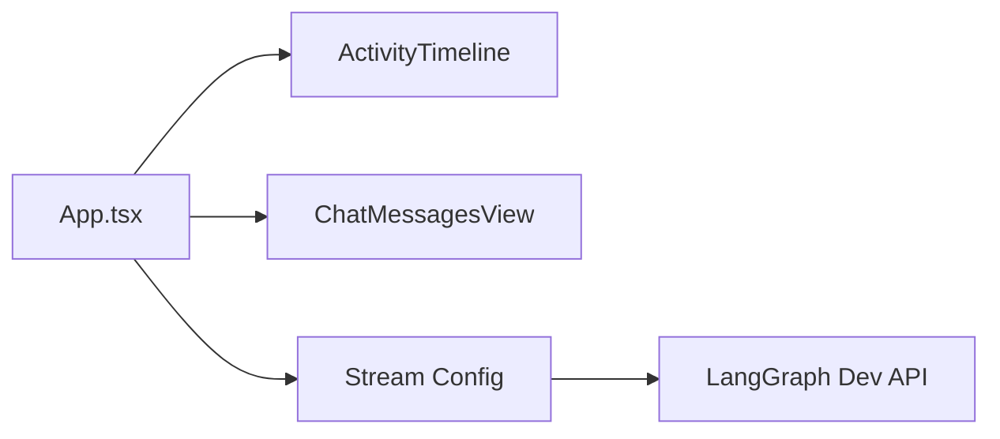

# Gemini LangGraph Frontend Steering Rules (Dev-Only)

Timestamp: 2025-08-13T23:24:51-04:00

## Version history

- v0.1.0 — 2025-08-13T23:24:51-04:00 — Initial dev-only rules

## Overview

- Stack: React 19 + Vite + Tailwind/Shadcn UI.
- Realtime: LangGraph SDK `useStream` connects to backend assistant `agent`.
- UI composes: `frontend/src/App.tsx` + components `components/ActivityTimeline.tsx`, `components/ChatMessagesView.tsx`, `components/WelcomeScreen.tsx`, `components/ui/button.tsx`, `components/ui/textarea.tsx`.

## Wiring (files, flow)

- `frontend/src/App.tsx`
  - `useStream` config:
    - `apiUrl`: `import.meta.env.DEV ? "http://localhost:2024" : "http://localhost:8123"` (dev uses 2024)
    - `assistantId: "agent"`, `messagesKey: "messages"`
    - `onUpdateEvent(event)`: maps node keys → activity timeline entries: `generate_query`, `web_research`, `reflection`, `finalize_answer`
    - `onError(error)`: sets error state for UI
  - Submission (`handleSubmit`):
    - Maps effort → counts: low(1,1), medium(3,3), high(5,10)
    - Sends: `{ messages, initial_search_query_count, max_research_loops, reasoning_model }`
  - Cancel (`handleCancel`): `thread.stop()` then `window.location.reload()`
  - Scrolling: keeps chat viewport pinned to bottom on new messages
  - Archival: after first `finalize_answer` event, stores processed timeline keyed by the last AI message id

## Config (dev)

- API URL: Dev is fixed to `http://localhost:2024` (backend `langgraph dev`).
- Assistant id: `agent` (must match backend `langgraph.json`).
- Messages key: `messages` (must match backend `OverallState.messages`).

## Behavior specifics (grounded in code)

- Timeline entries are derived from onUpdateEvent; `web_research` summarises `sources_gathered` and unique labels.
- Effort mapping controls backend `initial_search_query_count` and `max_research_loops`.
- `reasoning_model` is passed through to backend; backend can override via `Configuration`.
- Error UI: shows error JSON and provides destructive Retry button (reloads page).

## Best practices (Dev)

- **Stable stream wiring**: Keep `assistantId` and `messagesKey` aligned with backend reducers.
- **Event mapping**: Handle known node keys; ignore unknown keys safely.
- **State reset**: Prefer local state reset over full reload for cancel (future improvement); current behavior is acceptable in dev.
- **IDs**: Use stable/unique ids for messages (`Date.now().toString()` currently).
- **Scroll hygiene**: Keep viewport pinned for better UX during streaming.

## Anti-patterns / risks (current code)

- **Hard-coded URLs**: Dev API URL is hard-coded; avoid scattering this; consider single source (future: `VITE_API_URL`).
- **Heavy cancel**: `window.location.reload()` is blunt; a local-state reset path is preferable.
- **Brittle labels**: If backend `sources_gathered` items lack `label`, ensure mapping filters falsy values (already done).
- **Error handling**: Avoid swallowing stream errors; keep visible and actionable.

## Hygiene checks (quick)

- **Ports**: Dev UI at `http://localhost:5173/app`; API at `http://localhost:2024`.
- **Assistant id**: Must be `agent` end-to-end.
- **Event keys**: `generate_query`, `web_research`, `reflection`, `finalize_answer` present in backend stream.
- **Props**: `ChatMessagesView`/`ActivityTimeline` props match App.tsx usage; maintain index signatures where needed.

## Dev runbook

- Start dev: `make dev` (spins Vite and LangGraph dev API).
- Open UI: `http://localhost:5173/app`.
- Submit query: choose effort and model; observe streaming timeline.
- Cancel: click cancel; stream stops; page reloads.
- Retry on error: click Retry (reloads).

## Do / Don’t

- **Do**: Keep `useStream` options accurate; maintain simple, readable event mapping; debounce UI state churn when possible.
- **Do**: Keep cancel and error flows obvious during dev.
- **Don’t**: Introduce production-only flags here; don’t assume backend event shapes beyond observed keys; don’t drift `assistantId`/`messagesKey` from backend.

## Validation Checklist

- **Stream wiring**: `assistantId` is `agent` and `messagesKey` is `messages` (matches backend state schema).
- **API base**: Dev API resolves to `http://localhost:2024` (or `VITE_API_URL` if provided) consistently.
- **Event handling**: `onUpdateEvent` maps only known node keys (`generate_query`, `web_research`, `reflection`, `finalize_answer`) and ignores unknown safely.
- **Effort mapping**: Low/medium/high map to counts as documented; payload keys align with backend (`initial_search_query_count`, `max_research_loops`, `reasoning_model`).
- **Error surface**: Errors are visible to the user; Retry path works.
- **Sources rendering**: `sources_gathered` are deduped and labels filtered for falsy values before display.

## Rollback / Disable (Dev)

- **Reset stream**: Use `thread.stop()` then local state reset (current impl reloads page) to recover from bad states.
- **Force defaults**: Omit `reasoning_model` to allow backend `Configuration` defaults.
- **Static API URL**: When diagnosing, hard-set `VITE_API_URL` for clarity, then remove to restore standard behavior.

## Change Policy (Future-Proofing)

- **Stable IDs**: Keep `assistantId`/`messagesKey` stable and driven by shared contract with backend.
- **Configurable base**: Prefer a single source for API base (future `VITE_API_URL`); avoid scattering constants.
- **Event schema**: Add handling for new node keys additively; unknown keys continue to be ignored safely.

## Changelog Summary

- Added Validation, Rollback/Disable, Change Policy; aligned with project template.

## Open Questions

- Should cancel avoid full reload by default in dev (introduce local reset helper)?
- Do we want to expose a visible toggle for `VITE_API_URL` in dev UI, or keep it env-only?

## Relationships (mermaid)

