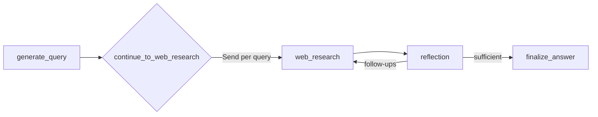

# Gemini LangGraph Backend Steering Rules (Dev-Only)

Timestamp: 2025-08-14T16:02:26-04:00

## Version history

- v0.1.1 — 2025-08-14T16:02:26-04:00 — Standardize sections, neutralize paths, lint fixes
- v0.1.0 — 2025-08-13T23:24:51-04:00 — Initial dev-only rules

## Overview

- Stack: FastAPI + LangGraph + LangChain + Google Gemini (google-genai + langchain-google-genai).
- Graph is defined in the graph module and exposed as assistant `agent` via a graph manifest.
- Required env: `GEMINI_API_KEY` (set in the dev environment).

## Wiring (files, nodes, flow)

- Graph module
  - Nodes: `generate_query` → `continue_to_web_research` (fan-out with `Send`) → `web_research` → `reflection` → `evaluate_research` route → `finalize_answer`.
  - Uses `ChatGoogleGenerativeAI` for LLM calls and `google.genai.Client().models.generate_content` for Google Search with `{ tools: [{ google_search: {} }] }`.
  - Compiled with `StateGraph(OverallState, config_schema=Configuration)` and `graph = builder.compile(name="pro-search-agent")`.
- Configuration module
  - `Configuration` fields: `query_generator_model`, `reflection_model`, `answer_model`, `number_of_initial_queries`, `max_research_loops`.
  - `from_runnable_config()` merges env + `configurable` (env var names are UPPERCASE of field names, e.g., `QUERY_GENERATOR_MODEL`).
- State module
  - `OverallState`, `QueryGenerationState`, `ReflectionState`, `WebSearchState` with reducers (`add_messages`, `operator.add`).
- Utilities module
  - `get_research_topic()`, `resolve_urls()`, `get_citations()`, `insert_citation_markers()`.

## Configuration & Env

- Load via `Configuration.from_runnable_config(config)` inside nodes.
- Defaults (dev-friendly):
  - `query_generator_model = "gemini-2.5-flash-lite"`
  - `reflection_model = "gemini-2.5-flash"`
  - `answer_model = "gemini-2.5-pro"`
  - `number_of_initial_queries = 3`
  - `max_research_loops = 2`
- Override via env (UPPERCASE field name) or `config["configurable"][name]`.

## State model (current)

- `OverallState` keys: `messages`, `search_query`, `web_research_result`, `sources_gathered`, `initial_search_query_count`, `max_research_loops`, `research_loop_count`, `reasoning_model`.
- `QueryGenerationState.search_query` typed as `list[Query]` but node returns `list[str]` (known mismatch).
- `WebSearchState.id` typed as `str` while fan-out sends `int(idx)` (known mismatch).

## Node behaviors (grounded in code)

- `generate_query(state, config)`
  - Ensures `initial_search_query_count` from state or `Configuration.number_of_initial_queries`.
  - LLM: `ChatGoogleGenerativeAI(model=configurable.query_generator_model)` with structured output `SearchQueryList`.
  - Returns `{ "search_query": list[str] }`.
- `continue_to_web_research(state)`
  - Returns list of `Send("web_research", { search_query, id: int(idx) })` — fans out per query.
- `web_research(state, config)`
  - Formats `web_searcher_instructions` and calls `genai_client.models.generate_content` with `model=configurable.query_generator_model` and `tools=[{ google_search: {} }]`.
  - Builds `resolved_urls = resolve_urls(candidate.grounding_metadata.grounding_chunks, state["id"])`.
  - Extracts citations via `get_citations(response, resolved_urls)`, inserts markers into `response.text` via `insert_citation_markers`.
  - Returns `sources_gathered`, `search_query` (appends current), `web_research_result`.
- `reflection(state, config)`
  - Increments `research_loop_count` and selects `reasoning_model = state.get("reasoning_model") or configurable.reflection_model`.
  - LLM: `ChatGoogleGenerativeAI(...).with_structured_output(Reflection)` on prior `web_research_result`.
  - Returns `is_sufficient`, `knowledge_gap`, `follow_up_queries`, `research_loop_count`, `number_of_ran_queries = len(state["search_query"])`.
- `evaluate_research(state, config)`
  - Reads `max_research_loops` from state or `Configuration.max_research_loops`.
  - If sufficient or loop cap reached → `finalize_answer`; else `Send("web_research", ...)` for follow-ups.
- `finalize_answer(state, config)`
  - LLM: `ChatGoogleGenerativeAI(model=state.get("reasoning_model") or configurable.answer_model)`.
  - Replaces each `short_url` found in the generated content with its original `value`; returns AI message and unique `sources_gathered`.

## Best practices (Dev)

- **Parallelize**: Use `Send()` in `continue_to_web_research()` to fan-out queries.
- **Structured outputs**: Use Pydantic schemas (`SearchQueryList`, `Reflection`) to constrain JSON from LLMs.
- **Reducers**: Keep `messages` with `add_messages`; aggregate lists with `operator.add` to preserve stream history.
- **Prompts/config separation**: Keep prompts in a prompts module, configuration in a configuration module, utilities in a utilities module.
- **Null-safety mindset**: Treat grounding metadata as optional; prefer guard patterns like in `get_citations()`.
- **Citation handling**: Maintain a stable short→original map via `resolve_urls`; insert markers after generation.

## Anti-patterns / risks (current code)

- **Grounding None access**: `web_research()` indexes `response.candidates[0].grounding_metadata.grounding_chunks` without checks; add guards before deref.
- **Type mismatches**: `QueryGenerationState.search_query` vs actual `list[str]`; `WebSearchState.id` vs actual `int` usage.
- **Fragile short-url replacement**: Final replacement depends on model echoing `short_url` exactly; consider carrying citation mapping into finalize phase explicitly.
- **Counting duplicates**: `len(state["search_query"])` may reflect appended runs, not distinct queries.

## Hygiene checks (quick)

- **Env**: `GEMINI_API_KEY` loaded; fail fast if missing.
- **Guards**: Before accessing `grounding_metadata` and `grounding_chunks`, verify presence; handle empty lists.
- **State counters**: Be explicit about `number_of_ran_queries` semantics; avoid using it for unique counts.
- **Logging (dev)**: Log request/response summaries and errors around grounding and structured outputs.

## Dev runbook

- Start dev: `make dev` (serves Vite UI on 5173/app and LangGraph dev API on 2024).
- Assistant id: `agent` (via graph manifest).
- Sanity: `curl http://localhost:2024/graphs` should list `agent` graph.

## Do / Don’t

- **Do**: Keep node responsibilities single-purpose; prefer structured outputs and reducers; guard None access.
- **Do**: Keep per-node model selection via `Configuration` fields already present.
- **Don’t**: Assume grounding metadata exists; don’t rely on `len(search_query)` for unique counts; don’t hardcode secrets.

## Validation Checklist

- **Config loading**: Nodes call `Configuration.from_runnable_config(config)` and do not access env directly.
- **Model selection**: Nodes read model names only from `configurable` (no hardcoded strings); see `backend/src/agent/configuration.py`.
- **State/reducers**: `messages` uses `add_messages`; list aggregations use `operator.add` as in `state.py`.
- **Grounding guards**: `web_research()` checks `response.candidates`, `grounding_metadata`, and `grounding_chunks` before indexing.
- **Type alignment**: Tracked mismatches (`QueryGenerationState.search_query` vs `list[str]`, `WebSearchState.id` vs `int`) are either fixed or called out in comments.
- **Loop control**: `max_research_loops` is respected in `evaluate_research()`; reflection either proceeds to `finalize_answer` or fans out follow-ups via `Send`.
- **Citations**: `resolve_urls()` map is built and used consistently; replacement in `finalize_answer` is verified with tests or logs.

## Rollback / Disable (Dev)

- **Defaults**: Clear env overrides to fall back to `Configuration` defaults (`query_generator_model`, `reflection_model`, `answer_model`, counts/loops).
- **Pin reasoning**: Remove `state["reasoning_model"]` to force defaults from `Configuration`.
- **Disable follow-ups**: Set `max_research_loops=0` via env/config to force single-pass reflection → finalize.
- **Search tool isolation**: If Google Search degrades, temporarily bypass follow-ups by constraining `follow_up_queries` handling to empty.

## Change Policy (Future-Proofing)

- **Stable node boundaries**: Keep node responsibilities and event keys (`generate_query`, `web_research`, `reflection`, `finalize_answer`) stable.
- **Schema evolution**: Any state shape changes must be reflected in `state.py` types and mentioned here; prefer additive changes.
- **Models**: Specific model names/versions live in `Configuration`; do not embed in node logic.
- **Tools**: Google Search tool wiring stays within `web_research`; do not spread tool calls across nodes.

## Changelog Summary

- Added Validation, Rollback/Disable, Change Policy. Aligned guidance with centralized config/model selection.

## Open Questions

- Should the Google Search tool use a distinct lightweight model vs `query_generator_model`?
- What is the target fix for the state type mismatches (timeline and owner)?
- Do we want to carry citation mapping through finalize via state rather than regenerate from text?

## Lotus Wisdom Alignment

- **Upaya (Skillful Means)**: Favor minimal, reversible changes; keep node boundaries stable; centralize config.
- **Direct**: Enforce validation via explicit guards, reducers, and env/config checks.
- **Gradual**: Phase 1 focuses on reliability and additive improvements; defer complex reasoning.
- **Embody**: Provide concrete rollback levers (env defaults, loop caps, tool isolation).

## Relationships (mermaid)

