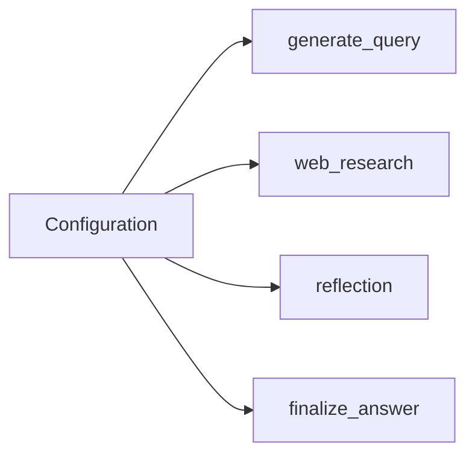

# Models and LLM Rules (Dev-Only)

Timestamp: 2025-08-14T16:20:00-04:00

## Version history

- v0.1.1 — 2025-08-14T16:20:00-04:00 — Add Scope/Expectations, Lotus Wisdom, neutralize paths, lint fixes
- v0.1.0 — 2025-08-14T11:22:57-04:00 — Initial dev-only rules

Owner: Dev Team (Backend — LLM Integration)
Status: Active (Dev)
Review cadence: Biweekly
Last reviewed: 2025-08-14T14:24:55-04:00

## Scope

- Dev-only guidance for selecting models per graph node.
- Centralize selection; avoid node-local hardcoding.

## References (components)

- Configuration module (centralizes defaults and env-configurable overrides).
- Graph module (nodes read model names from configuration only).

## Purpose (What + Why)

- Define how models are selected per node to balance latency/cost versus answer quality.
- Keep selection centralized and configurable so changes require no node code edits.

## When to Use

- Adjusting default models or per-node overrides for `generate_query`, `web_research`, `reflection`, `finalize_answer`.
- Tuning for faster iterations (dev) or higher quality (deep reasoning) within Phase 1 constraints.

## Where It Lives

- Central configuration in Configuration module.
- Nodes that call models in Graph module (must read values, not hardcode).

## Relationships (mermaid)

## How to Apply

- Choose per-node defaults in configuration (query vs research vs reflection vs finalization).
- Allow environment-driven overrides; document defaults and fallbacks in config docstrings/comments.
- Ensure nodes use only configuration-derived names; no inline model strings in node logic.
- Defer advanced "thinking/budget" features to later phases; keep Phase 1 simple and reliable.

## Rules and Guardrails

- Centralize model names in Configuration module; nodes in Graph module read from config only.
- Prefer faster models for query generation and lightweight steps; use more capable models for reflection/finalization when justified.
- All changes to model selection should be reversible via configuration or env without code edits.
- Document stable defaults and acceptable alternates; avoid model name drift across nodes.

## Anti-Patterns

- Hardcoding model strings inside graph nodes.
- Mixing experimental "thinking"/budget features into Phase 1 surface.
- Changing per-node model without updating documented defaults and fallbacks.

## Rollback / Disable (Dev)

- Revert to default model set by clearing env overrides; confirm nodes read configuration values.
- If a model degrades, switch impacted node(s) to the known-good default in configuration.

## Change Policy (Future-Proofing)

- Stable: Selection lives in configuration; nodes must not embed model names.
- Evolvable: Specific model names/versions and per-node mappings as requirements change.

## Validation Checklist

- Nodes contain no hardcoded model names; all resolved via Configuration module.
- Per-node mapping exists for query, research, reflection, and finalization; defaults documented.
- Env overrides take effect without code edits; fallbacks behave as expected.

## Changelog Summary

- Initial dev-only rules skeleton and centralized per-node selection guidance.

## Open Questions

- Are there planned alternates for the reflection/finalization defaults we should pre-document?

## Expectations (Dev)

- Keep per-node mapping aligned with backend configuration schema.
- Document default models and acceptable alternates visibly.

## Lotus Wisdom Alignment

- **Upaya (Skillful Means)**: Centralize model selection to enable minimal, reversible tweaks.
- **Direct**: Validate via a clear checklist: no hardcoded names; all from configuration.
- **Gradual**: Start with simple per-node defaults; evolve mappings additively.
- **Embody**: Provide rollbacks by clearing env overrides to restore defaults.
