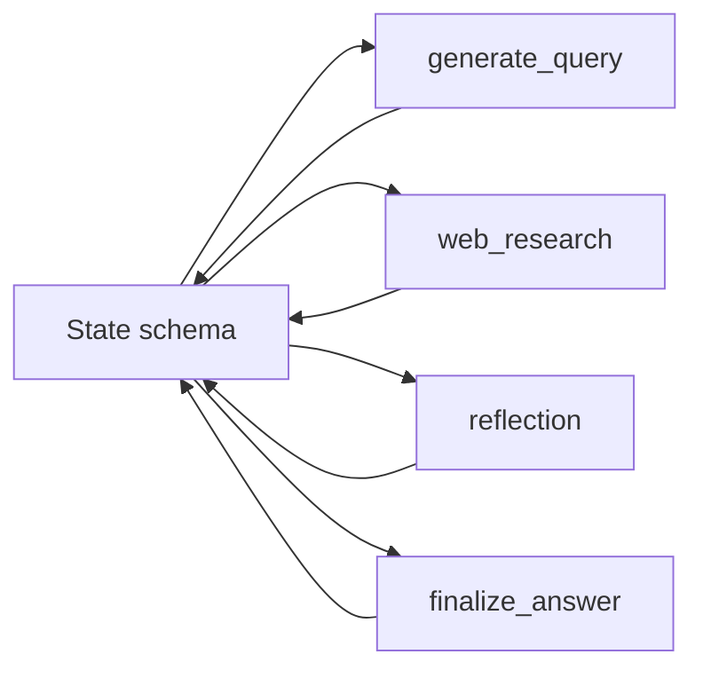

# State and Reducers Rules (Dev-Only)

Timestamp: 2025-08-14T16:40:00-04:00

## Version history

- v0.1.1 — 2025-08-14T16:40:00-04:00 — Add Scope/Validation/Rollback/Change Policy, neutralize refs, Lotus Wisdom, lint fixes
- v0.1.0 — 2025-08-14T11:22:57-04:00 — Initial dev-only rules

## Scope

- Dev-only guidance for state schema, reducers, and node-state interactions.
- Keep aggregation explicit and type-safe across the graph.

## References (components)

- `backend/src/agent/state.py` — state definitions and reducers.
- `backend/src/agent/graph.py` — nodes that read/write state via reducers.

## Guidance

- Messages aggregation uses a message-aware reducer.
- List-like fields aggregate by concatenation unless otherwise specified.
- Keep counters explicit (e.g., loop counts); don’t infer from list lengths unless documented.
- Align types across nodes and state; avoid implicit conversions.

## Mermaid (state touchpoints)

## Validation Checklist (Dev)

- Reducers are pure and associative; no side effects.
- Messages reducer handles streaming updates idempotently.
- All list aggregations are documented; counters are explicit.
- Node I/O types match state field types; no implicit coercions.

## Rollback / Disable (Dev)

- Revert to last known-good reducer implementations.
- Disable experimental fields by removing them from the state and guarding node writes.
- Add logging around reducer calls temporarily to triage aggregation issues.

## Change Policy (Future-Proofing)

- Prefer additive state fields; avoid breaking existing reducers.
- Changes to reducer semantics require updates to documentation and node callers.
- Keep message/event shapes stable; evolve via new fields.

## Changelog Summary

- v0.1.1 — Added Scope, Validation, Rollback/Disable, Change Policy; neutralized references.

## Open Questions

- Should we enforce a standard reducer signature for messages vs. lists?

## Lotus Wisdom Alignment

- **Upaya (Skillful Means)**: Explicit reducers and types reduce debugging effort.
- **Direct**: Validation checklist keeps reducers predictable and testable.
- **Gradual**: Add fields and reducers incrementally; avoid breaking changes.
- **Embody**: Fast rollback by reverting reducer changes or disabling fields.
