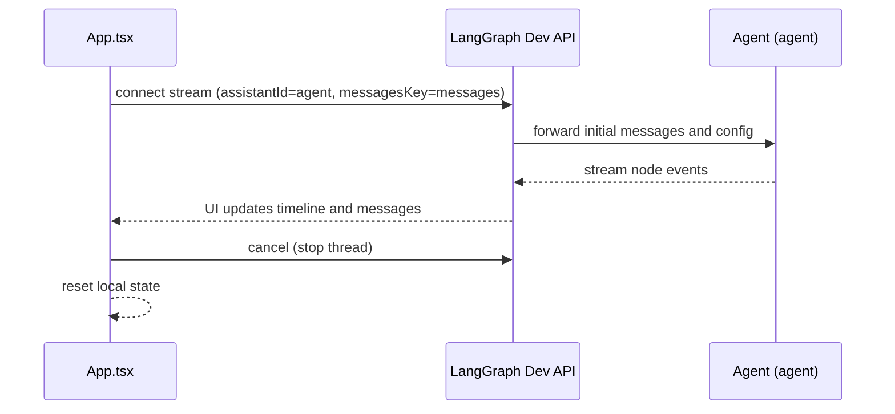

# Frontend Streaming and UX Rules (Dev-Only)

Timestamp: 2025-08-14T16:28:00-04:00

## Version history

- v0.1.1 — 2025-08-14T16:28:00-04:00 — Add Validation/Rollback/Change Policy, Lotus Wisdom; neutralize path refs; lint fixes
- v0.1.0 — 2025-08-14T11:22:57-04:00 — Initial dev-only rules

## Scope

- Streaming configuration and UX in the React app.
- Keep wiring aligned to backend assistant identity and message key.

## References (components)

- `frontend/src/App.tsx` — stream client (`useStream`), event handlers, cancel behavior.
- `frontend/src/components/ActivityTimeline.tsx` — renders node events.
- `frontend/src/components/ChatMessagesView.tsx` — chat transcript UI.

## Expectations (dev)

- `assistantId` is `"agent"`.
- `messagesKey` is `"messages"` (matches backend state key).
- API base in dev typically `http://localhost:2024` (LangGraph dev server); avoid scattering this value.

## UX Rules

- Maintain smooth streaming: append tokens/messages incrementally and keep the viewport pinned near bottom.
- Cancel should stop the current thread and reset local UI state without requiring a full reload where feasible.
- Errors should surface clearly with a visible retry path; do not suppress stream errors.
- Resume/cached threads (if enabled) should be opt-in and clearly indicated to users.

## Mermaid (stream lifecycle)

## Anti-patterns

- Hardcoding API URLs in multiple places; prefer a single source (e.g., env-based).
- Heavy-handed cancellation that forces page reload every time.
- Over-assuming event shapes beyond observed keys.

## Validation Checklist (Dev)

- Stream client connects with `assistantId=agent` and `messagesKey=messages`.
- Dev API reachable (e.g., `/graphs` includes `agent`).
- Unknown/extra event keys are ignored safely by UI handlers.
- CORS allows localhost during dev.
- A single configuration source controls API base URL.

## Rollback / Disable (Dev)

- Clear `VITE_API_URL` to use the default dev base.
- Temporarily disable streaming usage in UI to test request-only path.
- Revert to last known-good `assistantId` and `messagesKey`.

## Change Policy (Future-Proofing)

- Keep event keys stable; prefer additive changes.
- Do not add new endpoints; reference components/rules instead.
- Any schema changes must be reflected in backend state types and this doc.

## Changelog Summary

- v0.1.1 — Added Validation, Rollback/Disable, Change Policy, neutralized references, lint fixes.

## Open Questions

- Any reserved event keys to document for future-proof UI handlers?

## Lotus Wisdom Alignment

- **Upaya (Skillful Means)**: Single source for API base and stream wiring enables quick, safe changes.
- **Direct**: Validate stream connection via checklist; surface errors clearly.
- **Gradual**: Add event keys and UX affordances incrementally.
- **Embody**: Provide easy rollback paths (disable stream, clear API base, revert ids).
