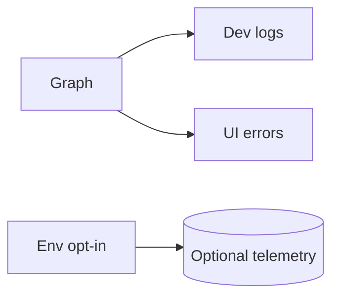

# Error, Logging, and Telemetry Rules (Dev-Only)

Timestamp: 2025-08-14T16:32:00-04:00

## Version history

- v0.1.1 — 2025-08-14T16:32:00-04:00 — Add Scope/Validation/Rollback/Change Policy, neutralize refs, Lotus Wisdom, lint fixes
- v0.1.0 — 2025-08-14T11:22:57-04:00 — Initial dev-only rules

## Scope

- Dev-only guidance for observability surfaces: logging, error surfacing, and optional telemetry.
- Keep signals actionable, minimal, and scrubbed of secrets.

## Guidance (dev)

- Log request/response summaries around external tools and model calls.
- Surface failures visibly in the UI; prefer explicit error surfaces over silent retries.
- Telemetry is optional and off by default in dev; enable only with explicit env opt-in.
- Ensure logs don’t contain secrets or excessive payloads.

## Mermaid (observability path)

## References (components)

- `backend/src/agent/graph.py` — node execution and error handling around tool/LLM calls.
- `backend/src/agent/configuration.py` — toggles for optional telemetry and log levels (dev-only).
- `frontend/src/App.tsx` — stream `onError` handler and user-facing error UI (retry/cancel).

## Validation Checklist (Dev)

- External tool and model calls log summary info (no secrets, no large payload dumps).
- UI presents clear error messages with retry and does not suppress stream errors.
- Telemetry is disabled by default; opt-in requires explicit env.
- Log level is configurable; debug noise can be reduced quickly.
- Known error boundaries exist in the UI to prevent full-app crashes.

## Rollback / Disable (Dev)

- Disable telemetry via env flag; fall back to console or simple logger.
- Reduce log level to warnings/errors if noisy.
- Remove recent log decorations if they cause PII risk or instability.

## Change Policy (Future-Proofing)

- Keep log formats stable; prefer additive fields.
- Never log secrets; sanitize at boundaries.
- Telemetry schemas evolve additively and remain optional in dev.

## Changelog Summary

- v0.1.1 — Added Scope, Validation, Rollback/Disable, Change Policy, neutralized references, lint fixes.

## Open Questions

- Standard minimal fields for error logs to aid triage?

## Lotus Wisdom Alignment

- **Upaya (Skillful Means)**: Minimal, actionable logs; optional telemetry.
- **Direct**: Clear UI error surfaces with retry.
- **Gradual**: Evolve log schemas additively, behind flags.
- **Embody**: Easy rollback via log level and telemetry off-switch.
