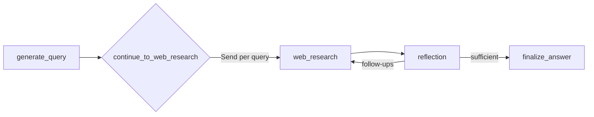

# Graph Design Rules (Dev-Only)

Timestamp: 2025-08-14T11:22:57-04:00

## Version history

- v0.1.0 — 2025-08-14T11:22:57-04:00 — Initial dev-only rules

## References (paths)

- `backend/src/agent/graph.py` — node and router wiring.
- `backend/src/agent/state.py` — state schema and reducers.

## Patterns

- Single-responsibility nodes: generation, research, reflection, finalization.
- Fan-out with `Send` for per-query parallelism.
- Router loops with explicit caps (e.g., `max_research_loops`).
- Keep prompts/config/utils in their modules; call from nodes.

## Mermaid (high-level flow)

## Guardrails

- Null-safety on external tool responses (e.g., grounding metadata may be absent).
- Structured outputs for parseable decisions.
- Keep loop state explicit (counts, caps).
- Maintain clear transition conditions between nodes.
